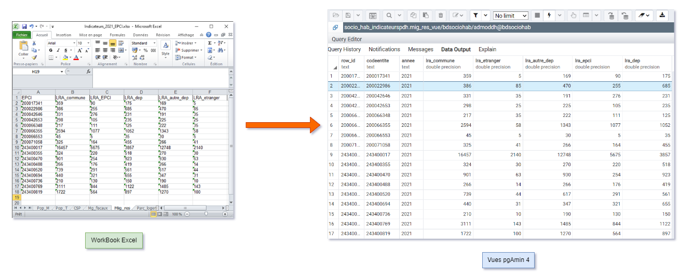

---
jupytext:
  cell_metadata_filter: -all
  formats: md:myst
  text_representation:
    extension: .md
    format_name: myst
    format_version: 0.13
    jupytext_version: 1.11.5
kernelspec:
  display_name: Python 3
  language: python
  name: python3
---


# Hello !

L'objectif de cette documentation est d'accompagner l'automatisation des processus de traitements et versements de données Excel vers **pgAdmin 4 `(posgreSQL)`**.<br>
Cette documentation explique donc dans un premier temps les façons de procéder pour déconstruire les jeux de données collectées sous format **classeur Excel `(extensions xlx et xlsx)`**, ensuite d'assurer la migration de ces données vers l'entrepôt de données **pgAdmin 4 `(posgreSQL)`** et enfin d'enregistrer ces données dans leurs structures originales en tant que **Vues `(posgreSQL)`**. 



```{note}
- Il est nécessaire d'avoir téléchargé la librairie **psycopg2** avant toute utilisation du programme universel.
    Veuillez trouver ci-dessous le code servant à l'installation de cette librairie
```

```{code-cell}
!pip istall psycopg2
```

```{seealso}
N'oubliez pas d'actualiser l'appelle aux de fonctions dans le script de traitement après une modification de fonction dans le fichier fonctions.py. Cela se fait comme suit: 
```

```{code-cell}
import importlib
importlib.reload(fonctions)
```


```{tableofcontents}
```

